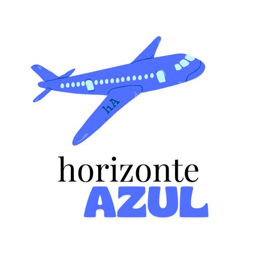

# 👤 Marta Vallés

## 💻 Presentació
Sóc estudiant del cicle **Desenvolupament d’Aplicacions Web** a l’IES l’Estació d’Ontinyent.  
M’interessa especialment el desenvolupament **fullstack** i les tecnologies relacionades amb **JavaScript, Python, Node.js, Tailwind etc.**.

---

## 🚀 Projecte personal
**Nom del projecte:**  *horizonte AZUL*  
**Descripció:**  Una aplicació web d’una aerolínia que permet als usuaris explorar viatges disponibles i realitzar reserves de manera fàcil i segura. 
Els usuaris podran consultar detalls dels viatges, seleccionar dates i gestionar les seves reserves. L’objectiu del projecte és oferir una experiència intuïtiva i accessible per a qualsevol persona interessada en viatjar.

---

## 🧰 Tecnologies i eines que utilitze
- Node.js  
- JavaScript  
- React
- Tailwind
- Git i GitHub  
- AWS
- MkDocs  

---

## 🌱 Objectius d’aprenentatge
1. Desenvolupar una aplicació web completa amb interacció entre frontend i backend.
2. Gestionar i mantenir un projecte en Git, amb control de versions i actualitzacions.
3. Crear una interfície intuïtiva que millori l’experiència de l’usuari en la reserva de viatges.
4. Aprendre a desplegar una aplicació en un entorn en núvol, garantint la seva disponibilitat.
5. Integrar funcionalitats dinàmiques, com consultes de viatges i gestió de reserves, de manera eficient i segura.

---

## 🔗 Enllaços d’interés
- [El meu perfil de GitHub](https://github.com/VallesMarta)
- [Projecte personal al repositori](https://github.com/VallesMarta/horizonteAzul)

---

## 💬 Frase o curiositat
> "No heu dixes per a dema si vas a fer-ho igual"  

---

## 🖼️ Foto o logotip

